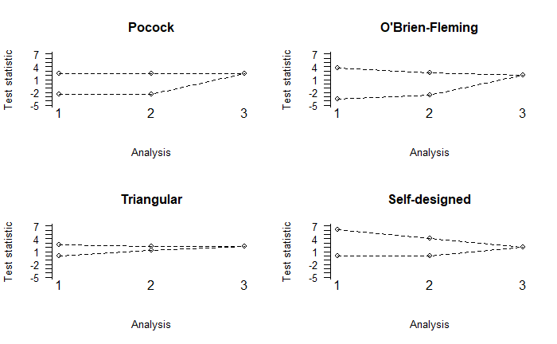

```{r setup, include=FALSE}
knitr::opts_chunk$set(echo = TRUE)

library(MAMS)
```

## Introduction\

Here we further consider the TAILoR study as motivating example but now with more than 1 stage (J>1).\  
Since only a single stage was used in this initial example, no form of the boundaries had to be specified. For multi-stage designs the shape of the lower and upper boundary can be defined via the arguments `lshape` and `ushape`. These arguments can either invoke the pre-defined shapes following [@pocock1977], [@obrien1979] or the triangular test [@whitehead1997] using options `"pocock"`, `"obf"`, or `"triangular"`, respectively. Alternatively a constant value (option `"fixed"`) can be specified. Finally, custom boundaries can be defined as a function that requires exactly one argument for the number of stages and returns a vector of the same length. The lower boundary shape must be non-decreasing while the upper boundary shape must be non-increasing to ensure reasonable trial designs are found.

## Triangular boundaries

In the following example we calculate a two-stage design investigating three experimental treatments. Triangular boundaries are used with a cumulative sample size ratio of `r=1:2` between first and second stage, i.e., the interim analysis is scheduled after half of the maximum number of patients have been recruited and their outcome observed, and twice as many subjects on control as on the experimental arms, as specified by `r0 = c(2, 4)`.

```{r eval=TRUE, include=FALSE}
m2 <- mams(K = 3, J = 2, p = 0.65, p0 = 0.55, r = 1:2, r0 = c(2, 4), alpha = 0.05, 
           power = 0.9, ushape = "triangular", lshape = "triangular")
```

```{r eval=FALSE, include=TRUE}
m2 <- mams(K = 3, J = 2, p = 0.65, p0 = 0.55, r = 1:2, r0 = c(2, 4), alpha = 0.05, 
           power = 0.9, ushape = "triangular", lshape = "triangular")
```

```{r}
m2
```

The cumulative sample sizes at stages 1 and 2 are given in tabular form in the R output. The trial may be stopped after the first analysis, either for futility (if all the $Z$ statistics are less than 0.786) or superiority (if at least one $Z$ statistic exceeds 2.359). In all other cases the trial is to be taken to the second stage where additional patients are randomized to any experimental treatment whose $Z$ statistic falls between the boundary values of the first stage and control. A critical value of 2.225 is used at the second analysis to decide whether a treatment shall be deemed superior to control or not.

## User defined function boundaries

Our next example involves three treatment arms in a three-stage design with equal numbers of subjects added at every stage as well as balance of sample size between control and treatment groups; this requires us to specify the cumulative sample sizes as `r=1:3` and `r0=1:3`. To illustrate the versatility of the function `mams,` we do not use any of the pre-defined boundary shapes. Instead we implement a fixed lower bound of zero (with `lshape = "fixed"` and `lfix = 0`) and an upper boundary where the first-stage critical value is three times as large as the final critical value. To achieve this, `ushape` is specified as a function that returns the vector (3, 2, 1) (`return(x:1)`).

```{r eval=TRUE, include=FALSE}
m3 <- mams(K = 3, J = 3, p = 0.65, p0 = 0.55, alpha = 0.05, power = 0.9, r = 1:3, 
           r0 = 1:3, ushape = function(x) return(x:1), lshape = "fixed", lfix = 0)
```

```{r eval=FALSE, include=TRUE}
m3 <- mams(K = 3, J = 3, p = 0.65, p0 = 0.55, alpha = 0.05, power = 0.9, r = 1:3, 
           r0 = 1:3, ushape = function(x) return(x:1), lshape = "fixed", lfix = 0)
```

```{r}
m3
```

The maximum total sample size is considerably lower than with design `m2` (324 versus 380), and so is the critical value at the final stage (2.042 versus 2.225). These feigned advantages come, however, at the cost of very large upper boundary values at stages 1 and 2 (6.125 and 4.084) that make it extremely hard to stop the trial early, so this is unlikely to be a useful design in practice. On a related note, if a design should not allow stopping for one of efficacy or futility at all, we can achieve this by setting `lfix = -Inf` or `ufix = Inf`, respectively.

## Compare Pocock, O'Brien-Fleming and triangular boundaries

We compare the boundaries of our "own" design `m3` with those of the corresponding standard designs (Pocock, O'Brien-Fleming, triangular) graphically using the plot function that comes with the **MAMS** package. First we have to compute the boundaries of the standard designs for `J = 3` stages and sample size allocations as in `m3`. Notice that the computation of designs with more than 2 stages can take several minutes.

```{r eval=FALSE, include=TRUE}
poc <- mams(K = 3, J = 3, p = 0.65, p0 = 0.55, r = 1:3, r0 = 1:3, alpha = 0.05, 
            power = 0.9, ushape = "pocock", lshape = "pocock")
obf <- mams(K = 3, J = 3, p = 0.65, p0 = 0.55, r = 1:3, r0 = 1:3, alpha = 0.05, 
            power = 0.9, ushape = "obf", lshape = "obf")
tri <- mams(K = 3, J = 3, p = 0.65, p0 = 0.55, r = 1:3, r0 = 1:3, alpha = 0.05, 
            power = 0.9, ushape = "triangular", lshape = "triangular")
```

Then we plot the boundaries with identical scaling of the vertical axes (using the argument `ylim`) to make the graphs visually comparable:

```{r eval=FALSE, include=TRUE}
par(mfrow = c(2, 2))
plot(poc, ylim = c(-5, 7), main = "Pocock")
plot(obf, ylim = c(-5, 7), main = "O'Brien-Fleming")
plot(tri, ylim = c(-5, 7), main = "Triangular")
plot(m3, ylim = c(-5, 7), main = "Self-designed")
```



Figure displays the shapes of all four designs. We see that the triangular design has clearly the narrowest boundaries (and therefore the highest chances of stopping the trial early) whereas the self-designed variant leads to extraordinarily high upper boundary values at the first two interim analyses.

## References
