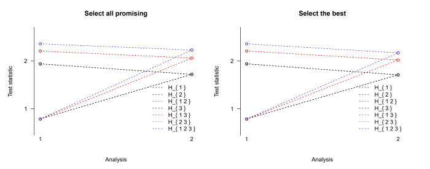

```{r setup, include=FALSE}
knitr::opts_chunk$set(echo = TRUE)

library(MAMS)
# library(kableExtra)
load("./bounds.RData")
```

A direct improvement over the basic design can be achieved by using a step-down version of the test. The function stepdown.mams implements such a design that selects at interim either all promising treatments `(selection = "all.promising")` or only the best performing treatment `(selection = "select.best")` from those whose test statistics are between the upper and lower boundaries [@stallard2003]. If the trial is stopped early, making a selection becomes obsolete, but note that we consider stopping boundaries as non-binding. The step-down procedure makes use of closed testing, as described in Section 2.2 [@jaki2019] and [@magirr2014].\

We reuse the three-arm two-stage design `m2`, studied in the [Multi-stage design section](multi-stage_design.html) with 76 and 38 observations in stage 1 and cumulative sample sizes at stage two of 152 and 76 on control and active treatments, respectively. The sample size of the study can be specified through the matrix `nMat` that has $J$ rows and $K$ columns where the first column contains the values for the control group. A lower boundary can be set via `lb`, and we set it to $0.786$ as in the original design. We can then choose how much of the total family-wise error we want to spend at each stage using the argument `alpha.star`, and we choose to spend, in line with the triangular test, $\alpha^*_1 = 0.026$ \$ the first interim analysis, with the remaining $α$ level being used at the second analysis. We compare the selection rules `all.promising` and `select.best`:

```{r eval=FALSE, include=TRUE}
m2.all <- stepdown.mams(nMat = matrix(c(76, 152, rep(c(38, 76), 3)),
 nrow = 2, ncol = 4), lb = m2$l[1], alpha.star = c(0.026, 0.05),
selection = "all.promising")

m2.best <- stepdown.mams(nMat = matrix(c(76, 152, rep(c(38, 76), 3)),
nrow = 2, ncol = 4), lb = m2$l[1], alpha.star = c(0.026, 0.05),
selection = "select.best")
```

The following table reports the upper boundary values for selected scenarios.

| Hypotheses                 | Stage 1 | Stage 2 (best) | Stage 2 (all) |
|----------------------------|:-------:|:--------------:|:-------------:|
| $H_1$,$H_2$,$H_3$          |  1.94   |      1.71      |     1.72      |
| $H_{12}$,$H_{13}$,$H_{23}$ |  2.21   |      2.02      |     2.06      |
| $H_{123}$                  |  2.36   |      2.17      |     2.22      |

One can see that the option to proceed with more than one promising treatment comes at the cost of higher stopping boundaries for the intersection hypotheses at stage 2. So in order to reject the global null hypothesis at the second stage, a test statistic needs to exceed 2.22 while it only needs to be larger than 2.17 if only the best arm is chosen at the interim analysis. The boundaries are the same for the elementary hypotheses H1, H2, and H3 as well as for the intersection hypotheses H12, H13, and H23 because the sample sizes were chosen to be equal in all active treatment arms. A graphical display of the stopping boundaries using the plot function is shown in Figure.

```{r eval=TRUE, include=FALSE}
par(mfrow = c(1, 2))
plot(m2.all, main = "Select all promising", col = c(1, 1, 2, 1, 2, 2, 4))
plot(m2.best, main = "Select the best", col = c(1, 1, 2, 1, 2, 2, 4))
```

\
Figure: Stopping boundaries for a three-arm two-stage step-down design with selection of all promising treatments at interim (left) or just the single best treatment (right).

## References
